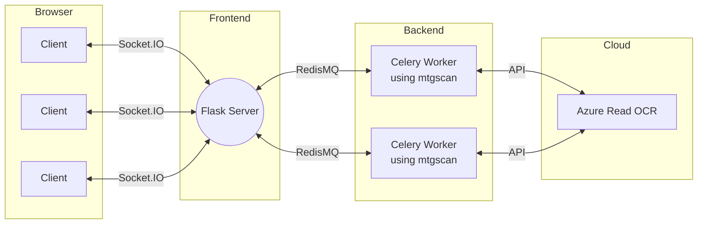

# MTGScan
[](https://opensource.org/licenses/MIT)
[](https://www.codefactor.io/repository/github/fortierq/mtgscan)


MTGScan uses OCR recognition to list Magic cards from an image.  
After OCR, cards are looked up in a dictionnary provided by [MTGJSON](https://mtgjson.com), using fuzzy search with [SymSpell](https://github.com/wolfgarbe/SymSpell).

## [Try the Web App](http://mtgscan.net) (DOWN for now)

[Repository for the web app](https://github.com/fortierq/mtgscan-app)

## Prerequisites

- Python >= 3.7
- (Recommended) Poetry
- Credentials for the required OCR (e.g Azure Computer Vision Read API)

## Installation

### ... with Poetry

```python
poetry install
```

### ...  with pip

```console
pip install mtgscan
```

### ... with docker

See https://github.com/fortierq/mtgscan-app

## OCR

Currently, only Azure OCR is supported. To add an OCR, inherit mtgscan.ocr.OCR.  

### Azure

API subscription key and endpoint must be stored in environment variables `AZURE_VISION_KEY` and `AZURE_VISION_ENDPOINT` respectively.  
Steps:
- Subscribre for a free Azure account: https://azure.microsoft.com/free/cognitive-services
- Create a Computer Vision resource: https://portal.azure.com/#create/Microsoft.CognitiveServicesComputerVision
- Get your key and endpoint

## Tests

Every test case is stored in a separated folder in tests/samples/ containing:
- image.*: image of Magic cards
- deck.txt: decklist of the cards on the image

To run every test:
```python
poetry run python tests/test.py
```

This produces the following outputs, for each sample and OCR:
- statistics about number of cards found, number of errors...
- test.log: informations about the run
- errors.txt: history of the number of errors made by the OCR
- box_texts.txt: output of the OCR

## Example

[This example](./example.py) scans the following screenshot:


```
$ poetry run python example.py

Loading https://mtgjson.com/api/v5/VintageAtomic.json
Loaded all_cards.txt: 23253 cards
Loading https://mtgjson.com/api/v5/Keywords.json
Loaded Keywords.json: 282 keywords
4 Ancient Tomb
4 Mishra's Factory
4 Mishra's Workshop
1 Strip Mine
1 Tolarian Academy
4 Wasteland
1 Sacrifice
1 Mox Ruby
1 Mox Emerald
1 Mox Jet
1 Mox Pearl
1 Mox Sapphire
1 Black Lotus
1 Mana Crypt
1 Sol Ring
4 Phyrexian Revoker
4 Arcbound Ravager
1 Thorn of Amethyst
4 Sphere of Resistance
4 Foundry Inspector
3 Chief of the Foundry
1 Trinisphere
1 Lodestone Golem
1 Mystic Forge
2 Fleetwheel Cruiser
1 Traxos, Scourge of Kroog
4 Walking Ballista
3 Stonecoil Serpent
1 Chalice of the Void

3 Mindbreak Trap
4 Leyline of the Void
2 Crucible of Worlds
4 Pithing Needle
2 Wurmcoil Engine
```
